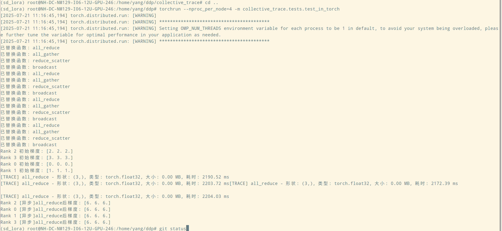
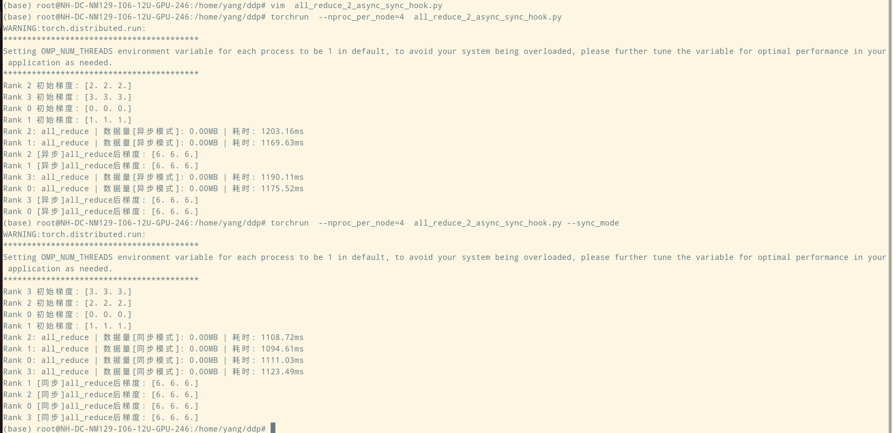

# collective_trace

Trace collective operations for distributed training.

## Usage

```bash
# Develop
git clone https://github.com/yangrudan/collective_trace.git
cd collective_trace
pip install -e .

cd ..
torchrun --nproc_per_node=4 -m collective_trace.tests.test_in_torch
```

**Results**


## Prototype


