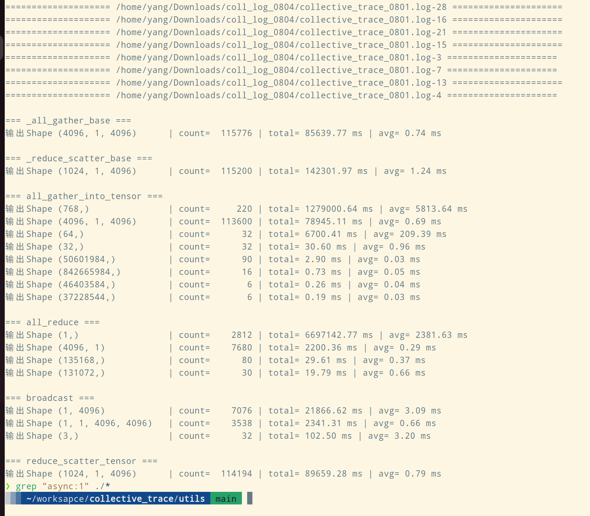

# collective_trace

Trace collective operations for distributed training.

## 0x01 Develop

```bash
# Develop
git clone https://github.com/yangrudan/collective_trace.git
cd collective_trace
pip install -e .

cd ..
torchrun --nproc_per_node=4 -m collective_trace.tests.test_in_torch
torchrun --nproc_per_node=4 -m collective_trace.tests.test_in_cpu --sync_mode 

# or
cd collective_trace
PYTHONPATH=/home/yang torchrun --nproc_per_node=4 tests/test_in_torch.py
```

## 0x02 Usage

```bash
# Install
git clone https://github.com/yangrudan/collective_trace.git
cd collective_trace
pip install -e .
```

Manual update training code:

```python
import torch
import torch.distributed as dist

from collective_trace.collective_trace import trace_all_collectives

trace_all_collectives(trace_file='collective_trace.log')

import megatron  # Megatron此时导入的是已替换的函数
# Your training code here

```

<!-- **Prototype**


**version 0.0**
 -->

**version 0.1 Results**


## 0x03 Util

```
cd utils
python parse_coll_info.py
```

